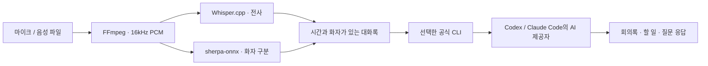

<div align="center">

# 미팅모아 · MeetingMoa

**대화에 집중하세요. 기록은 미팅모아가 할게요.**

Mac에서 녹음하고, 화자별 대화록과 다음 할 일을 정리하는 오픈소스 회의 노트 앱.

[](#시작하기)
[](#어떻게-동작하나요)
[](LICENSE)

[시작하기](#시작하기) · [화면 보기](docs/SCREENSHOTS.md) · [AI 연결](docs/AI-PROVIDERS.md) · [개인정보 처리](docs/PRIVACY.md)

</div>


> **v0.2 개발 미리보기.** 현재는 소스에서 빌드하는 Mac 앱입니다. 음성 인식·발화자 구분은 로컬에서, 회의록 요약·질문 응답은 사용자가 선택한 Codex 또는 Claude Code로 처리합니다. OpenAI·Anthropic과 제휴하거나 인증받은 제품이 아닙니다.

## 할 수 있는 일

- **녹음과 가져오기** — Mac 마이크로 녹음하거나 기존 음성 파일을 가져옵니다.
- **화자별 대화록** — 한국어 전사, 발화자 구분, 시간 표시를 제공합니다.
- **듣고 수정하기** — 시각을 눌러 원문을 재생하고 문장·화자 이름을 수정합니다.
- **회의록 정리** — 주요 논의, 결정 사항, 담당자·기한이 있는 할 일을 모읍니다.
- **회의에 질문하기** — 대화록을 근거로 답하고 원문 시각을 표시합니다.
- **AI 선택** — 회의 상단이나 설정에서 Codex / Claude Code를 선택합니다.
- **내보내기** — 회의록과 대화록을 Markdown 파일로 저장합니다.

| 화자별 대화록 | 회의록과 할 일 |
| --- | --- |
|  |  |

화면 속 회의는 **문서용 가상 데이터**입니다. 실제 사용자 이름, 회의, 녹음, 이메일을 사용하지 않았습니다. 예시 문구는 화면 설명을 위해 작성한 것으로 모델 정확도 평가 결과가 아닙니다.

## 시작하기

### 준비물

- macOS 14 이상, Apple Silicon Mac 권장
- Swift 5.9 이상이 포함된 Xcode Command Line Tools
- [Homebrew](https://brew.sh), `uv`, `ffmpeg`, `whisper-cpp`
- AI 요약·채팅에 사용할 [Codex CLI](https://developers.openai.com/codex/cli/) 또는 [Claude Code](https://code.claude.com/docs/en/setup)
- 음성 모델용 약 600MB와 Python 런타임을 설치할 여유 공간

Apple Silicon / macOS 26.5.2에서 확인했습니다. Intel Mac은 아직 검증하지 않았습니다.

```bash
xcode-select --install   # 이미 설치했다면 생략
brew install uv ffmpeg whisper-cpp

git clone https://github.com/jmmi/meeting-moa.git
cd meeting-moa
./scripts/setup.sh
./scripts/build.sh
open dist/미팅모아.app
```

`setup.sh`는 앱 전용 Python 환경과 공개 음성 모델을 사용자 Application Support에 설치합니다. 모델 파일은 Git 저장소에 포함되어 있지 않습니다. 빌드는 로컬 실행용 ad-hoc 서명이며 Apple 공증 배포판이 아닙니다. 앱만 다른 Mac에 복사하면 런타임·CLI가 없어 동작하지 않을 수 있습니다.

### AI 연결

사용할 CLI를 공식 안내에 따라 설치하고 그 CLI에서 직접 로그인합니다.

```bash
# Codex에서 ChatGPT로 로그인
codex login

# 또는 Claude Code의 공식 로그인
claude auth login
```

앱의 왼쪽 하단 설정 → **연결 새로고침** → 사용할 AI 선택.

- **Codex**: 현재 어댑터는 ChatGPT로 로그인된 공식 Codex CLI를 사용합니다.
- **Claude Code**: 수정하지 않은 공식 CLI와 사용자의 인증 설정을 사용합니다. 구독 로그인뿐 아니라 사용자가 설정한 API 키·지원 제공자 인증도 CLI에 맡깁니다. API 키가 적용되면 API 요금이 발생합니다.
- 앱은 자체 Claude.ai OAuth 로그인을 구현하지 않으며, 토큰·비밀번호를 수집하거나 복사하지 않습니다.
- 각 제공자의 사용 한도, 요금, 약관이 적용됩니다. 앱 연동과 공개 배포 관련 조건은 [AI 연결 문서](docs/AI-PROVIDERS.md)를 확인하세요.

AI 로그인이 없어도 음성 전사와 발화자 구분은 로컬에서 사용할 수 있습니다.

### 첫 회의

1. **새 회의 녹음** → 최초 마이크 접근 허용 → **녹음 종료 · 분석**.
2. 파일은 **음성 파일 가져오기** → 언어·화자 수 선택 → **대화록 분석 시작**.
3. 대화록의 시각을 눌러 들어보고, 잘못 인식된 문장이나 화자 이름을 수정합니다.
4. **회의록**에서 요약을 확인하거나 **AI에게 질문**에서 후속 질문을 합니다.
5. **내보내기**를 눌러 Markdown을 저장합니다.

기본값은 전사 후 **자동 요약 켜짐**입니다. 설정에서 끄면 사용자가 요약·질문을 실행할 때만 대화록을 AI 제공자에게 전송합니다. 원문이나 화자를 수정하면 기존 요약·채팅이 초기화되므로 다시 정리해주세요.

## 어떻게 동작하나요



SwiftUI 앱이 녹음·재생·저장을 담당하고 Python 작업자가 로컬 음성을 분석합니다. AI 요청에는 대화록 텍스트와 필요시 이전 질문을 전달합니다. **음성 처리가 로컬이라는 말은 요약까지 오프라인이라는 뜻이 아닙니다.** [데이터 흐름과 저장 위치](docs/PRIVACY.md)

| 구성 요소 | 역할 |
| --- | --- |
| SwiftUI / AVFoundation | Mac 화면, 마이크 녹음, 재생 |
| Whisper.cpp large-v3-turbo q5_0 | 음성 전사, Apple Silicon Metal 사용 |
| sherpa-onnx + segmentation / embedding models | 발화 구간과 목소리 그룹 추정 |
| 공식 Codex / Claude Code CLI | 구조화된 요약과 대화록 질의응답 |
| 로컬 JSON + 원본 음성 | 회의 보관 |

## 현재 범위

- 녹음 **종료 후** 분석합니다. 실시간 전사는 아직 없습니다.
- 온라인 회의의 **시스템 소리 직접 녹음은 미지원**입니다. 마이크 또는 별도로 저장한 파일을 사용하세요.
- iPhone 앱과 기기 간 동기화는 아직 없습니다.
- 파일당 최대 4시간을 허용하지만 장시간 회의 부하·정확도는 충분히 검증하지 않았습니다.
- 겹쳐 말하기, 소음, 짧은 발화, 비슷한 목소리에서 오류가 생길 수 있습니다. 화자 구분은 실명 식별이 아닙니다.
- 중요 결정과 담당자·기한은 원문과 대조해주세요. 전사 오타가 요약에 영향을 줄 수 있습니다.
- 로컬 회의 파일은 앱 자체 암호화가 적용되지 않습니다.

## 개발과 기여

```bash
swift build -c release
python3 -m unittest discover -s tests -v
```

- [기여 가이드](CONTRIBUTING.md)
- [보안 신고](SECURITY.md)
- [검증한 범위와 한계](VALIDATION.md)
- [합성 음성 테스트와 스크린샷 만들기](docs/DEMO.md)

작업 계획: 시스템 오디오 캡처, 녹음 안정성·장시간 테스트, 더 나은 화자 구분, 설치 간소화, iPhone 연동.

## 라이선스

직접 작성한 앱·작업자·문서는 [MIT](LICENSE)입니다. 외부 CLI, 라이브러리, 음성 모델, macOS 음성의 라이선스와 서비스 약관은 별도로 적용됩니다. [외부 구성 요소](THIRD_PARTY_NOTICES.md)

---

**English:** MeetingMoa is an open-source native macOS meeting notes app. It transcribes and diarizes recordings locally, then uses the user's installed Codex or Claude Code CLI for summaries and transcript Q&A. This is a source-build preview, not a notarized standalone distribution. Screenshots contain fictional demo data only.
