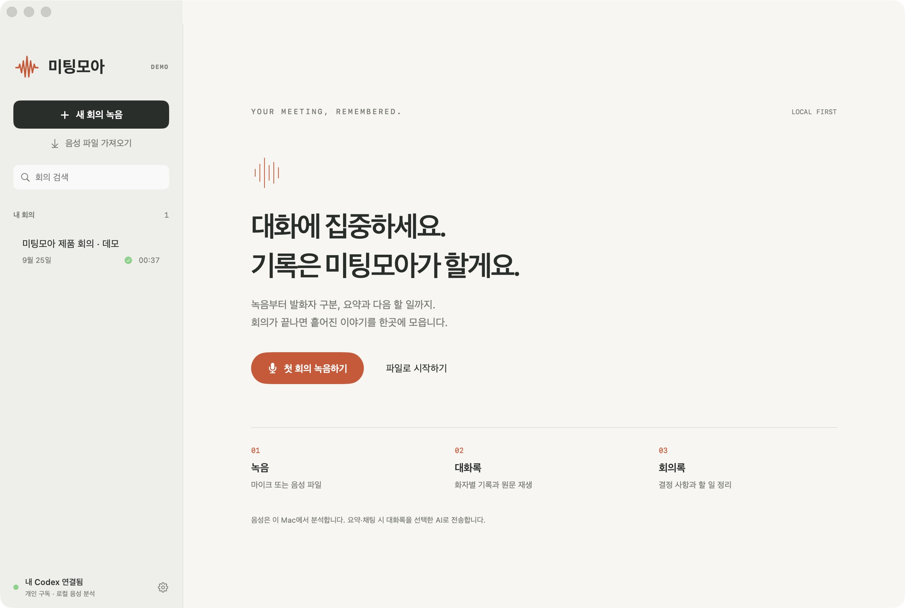
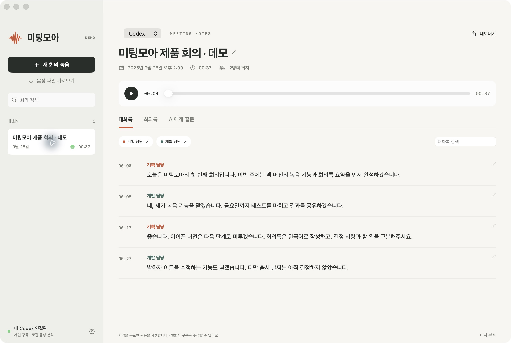
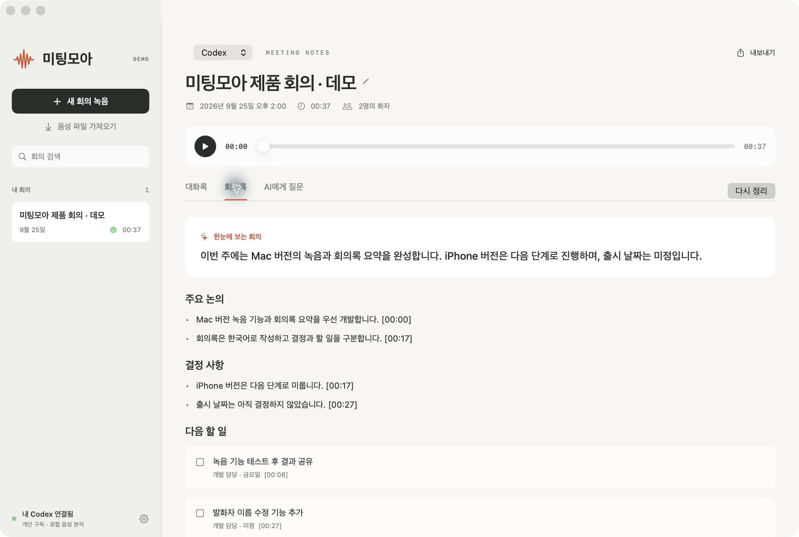
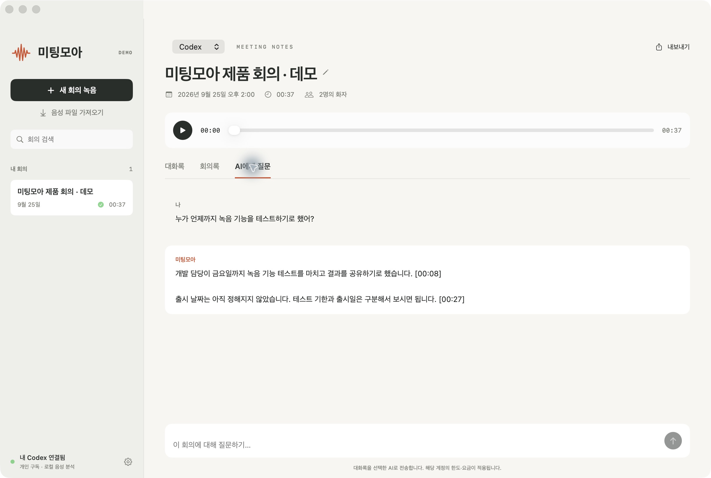
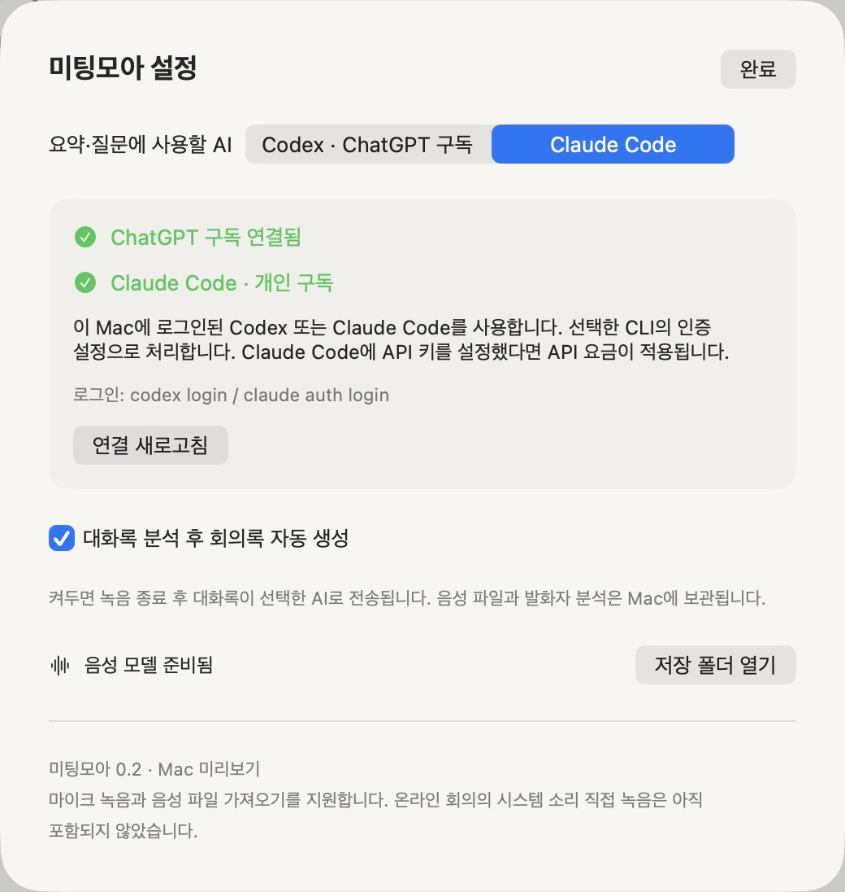

# 미팅모아 화면

실행 중인 SwiftUI 앱을 직접 캡처했습니다. 모든 회의 내용과 역할은 `scripts/seed_demo.py`가 만든 **가상 데모 자료**입니다. 사용자 회의 저장소는 읽지 않았으며 개인 녹음이나 계정 식별자는 포함하지 않았습니다.

## 시작 화면

## 발화자별 대화록

시각으로 원문을 재생하고, 이름과 문장을 수정할 수 있습니다.

## 회의록과 다음 할 일

## 원문에 근거한 질문

## Codex / Claude Code 선택

연결 상태에는 이메일·조직 ID·토큰을 표시하지 않습니다.

